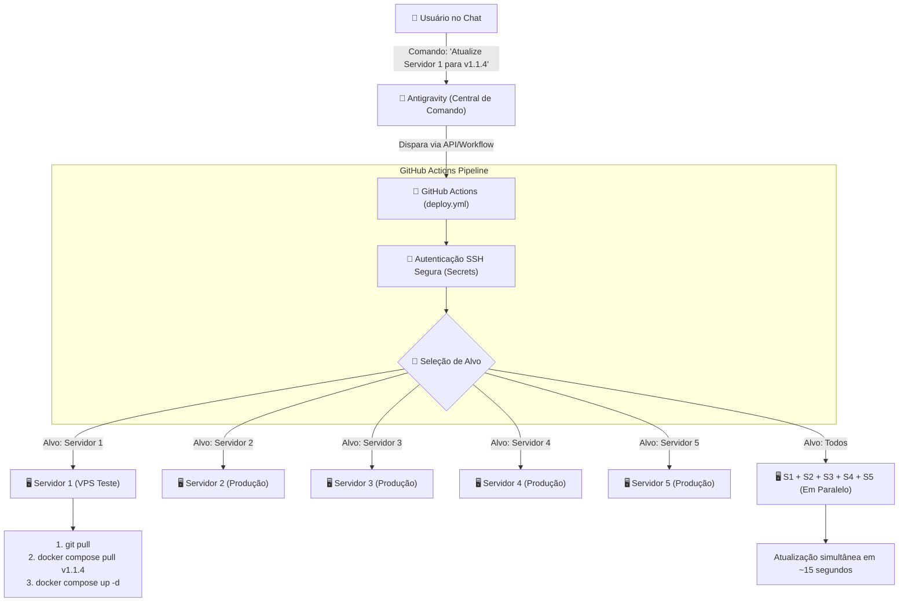

# 🚀 Plano de Implementação: Deploy Multi-Servidor & Rollback via Chat

Este documento descreve a arquitetura, arquivos e tarefas para automatizar o **Deploy Multi-Servidor** e o **Rollback Instantâneo** das imagens Docker do Oráculo, permitindo que todo o controle de infraestrutura seja feito diretamente através de comandos em linguagem natural no chat.

---

## 🎯 1. Objetivo do Sistema

1. **Deploy Canário / Gradual:** Atualizar 1 servidor específico (ambiente de teste/piloto) antes de propagar para os demais.
2. **Deploy em Massa:** Atualizar todos os servidores cadastrados simultaneamente em paralelo.
3. **Rollback Instantâneo (< 10 segundos):** Reverter qualquer servidor para uma versão estável anterior sem perda de dados e sem rebuild.
4. **Controle 100% pelo Chat:** O agente atua como a central de comando, disparando os workflows no GitHub Actions e reportando o status ao usuário em tempo real.
5. **Segurança Máxima (Zero Trust):** Uso de chaves SSH isoladas por servidor e protegidas no cofre do GitHub Secrets, sem abertura de portas vulneráveis.

---

## 🏗️ 2. Arquitetura da Solução

---

## 📁 3. Componentes e Arquivos a Serem Criados / Atualizados

### 1. [NOVO] [`.github/workflows/deploy.yml`](file:///c:/Users/aryar/.gemini/antigravity/scratch/Projetos%20Serios/Oraculo%20-%20Manager/.github/workflows/deploy.yml)
Workflow dedicado ao deploy e rollback nos servidores.
- **Gatilho:** `workflow_dispatch` (permite execução manual e via API).
- **Inputs:**
  - `target_server`: `[ ALL, SERVER_1, SERVER_2, SERVER_3, SERVER_4, SERVER_5 ]`
  - `version`: Número da tag da imagem (ex: `1.1.4`)
  - `action`: `deploy` ou `rollback`
- **Estratégia:** Matrix strategy para execução paralela em múltiplos servidores.

### 2. [NOVO] [`scripts/deploy_runner.mjs`](file:///c:/Users/aryar/.gemini/antigravity/scratch/Projetos%20Serios/Oraculo%20-%20Manager/scripts/deploy_runner.mjs)
Script em Node.js para que o agente possa disparar o workflow no GitHub Actions diretamente a partir do chat, acompanhar a execução e retornar o status detalhado.

### 3. [NOVO] [`.agents/rules/deploy-servidores.md`](file:///c:/Users/aryar/.gemini/antigravity/scratch/Projetos%20Serios/Oraculo%20-%20Manager/.agents/rules/deploy-servidores.md)
Regra permanente do sistema para instruir o agente sobre:
- Como interpretar pedidos de deploy e rollback no chat.
- Protocolo de confirmação antes de disparos em massa.
- Como relatar o progresso de cada servidor.

### 4. [NOVO] [`docs/GUIA_CONFIGURACAO_SERVIDORES.md`](file:///c:/Users/aryar/.gemini/antigravity/scratch/Projetos%20Serios/Oraculo%20-%20Manager/docs/GUIA_CONFIGURACAO_SERVIDORES.md)
Guia passo a passo com os comandos exatos que o usuário precisa colar em cada servidor para autorizar a chave SSH e configurar os Secrets no GitHub.

---

## 📋 4. Plano de Tarefas de Execução

- [ ] **Tarefa 1:** Criar o workflow [`.github/workflows/deploy.yml`](file:///c:/Users/aryar/.gemini/antigravity/scratch/Projetos%20Serios/Oraculo%20-%20Manager/.github/workflows/deploy.yml) com suporte a alvos individuais e em massa.
- [ ] **Tarefa 2:** Criar o script auxiliar [`scripts/deploy_runner.mjs`](file:///c:/Users/aryar/.gemini/antigravity/scratch/Projetos%20Serios/Oraculo%20-%20Manager/scripts/deploy_runner.mjs) integrado ao GitHub Actions.
- [ ] **Tarefa 3:** Criar a regra permanente [`.agents/rules/deploy-servidores.md`](file:///c:/Users/aryar/.gemini/antigravity/scratch/Projetos%20Serios/Oraculo%20-%20Manager/.agents/rules/deploy-servidores.md).
- [ ] **Tarefa 4:** Criar o guia prático [`docs/GUIA_CONFIGURACAO_SERVIDORES.md`](file:///c:/Users/aryar/.gemini/antigravity/scratch/Projetos%20Serios/Oraculo%20-%20Manager/docs/GUIA_CONFIGURACAO_SERVIDORES.md).
- [ ] **Tarefa 5:** Executar testes locais de auditoria de limites (`npm test`) e validação de sintaxe.
- [ ] **Tarefa 6:** Consultar a versão da imagem com o usuário e realizar o commit/push no repositório oficial.

---

## 🛡️ 5. Plano de Verificação

1. **Validação Estática:** Executar `npm test` para garantir que os novos arquivos respeitam os limites de código (< 500 linhas no frontend/scripts e < 1.000 no backend).
2. **Validação de Sintaxe YAML:** Validar o workflow `.github/workflows/deploy.yml`.
3. **Simulação de Execução:** Testar a chamada do `deploy_runner.mjs` com parâmetros de teste.
